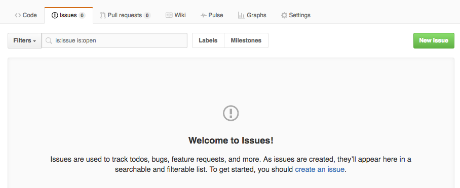

> ## Learning Objectives {.objectives}
>
> * Demonstrate ability to clone a GitHub repository.
> * Give feedback on a project using GitHub Issues.

> ## Prerequisites {.prereq}
>
> You should have just completed the [previous activity](http://jesford.github.io/python-reproducible-research/02-create.html),
> and traded post-it notes of Topics and repository URLs, so that every pair of 
> learners is ready to recreate another group's analysis. Within each pair, learners
> should swap roles of "driver" and "navigator".

In the previous activity you used GitHub to publish your investigation of one of the topics. Now let's find out how easy you made it for another group to understand and reproduce your analysis. If you haven't already done it, swap driver-navigator roles within each pair.

> ## Reproducible another group's analysis {.challenge}
>
> Start out by going to the repository for the other group, and reading their README 
> (if one is available). Then clone the repository to your laptop and see if you 
> can reproduce the same steps of the analysis. Are you able to follow everything
> they have done? Do you come to the same conclusions about the data?

~~~ {.bash}
$ git clone https://github.com/myusername/my-cool-project
$ cd my-cool-project
~~~ 

> ## Tips {.callout}
>
> Do you have any questions or suggestions for group who's results you are trying 
> to reproduce? Pretend they are not in the same room (so you can't just talk to 
> them), and submit a GitHub issue. To create an issue, select "Issues" from the 
> GitHub toolbar, then click the green button for "New Issue".
>
> 
>
> You can use the same Markdown formatting we discussed earlier. 
